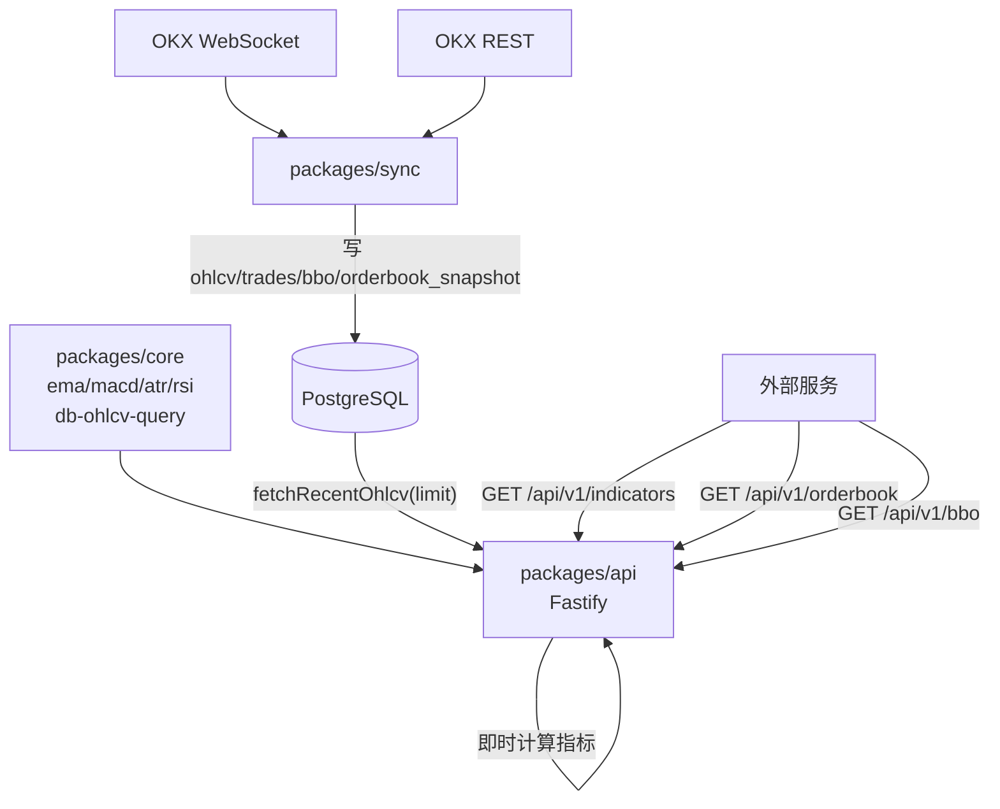

# Monorepo + RSI + 订单簿 + Fastify API

## 目标目录结构

```
sync-indicator/                    ← monorepo root
├── pnpm-workspace.yaml
├── package.json                   ← workspace root（无 src）
├── packages/
│   ├── core/                      ← @sync-indicator/core（共享）
│   │   ├── package.json
│   │   ├── tsconfig.json
│   │   └── src/
│   │       ├── types/             ← 现有 types/ 原样迁移
│   │       ├── indicators/        ← ema/macd/atr/macd-cross + 新增 rsi.ts
│   │       ├── data/
│   │       │   ├── db.ts          ← pool 管理
│   │       │   ├── db-ohlcv-query.ts
│   │       │   ├── db-indicators.ts
│   │       │   ├── normalize.ts
│   │       │   └── clean-ohlcv.ts
│   │       ├── config/
│   │       └── ops/logger.ts
│   ├── sync/                      ← @sync-indicator/sync（同步服务）
│   │   ├── package.json
│   │   ├── tsconfig.json
│   │   └── src/
│   │       ├── data/sources/      ← okx.ts / okx-ws*.ts + 新增 okx-ws-orderbook.ts
│   │       ├── data/              ← db-bbo / db-trades / db-instruments + 新增 db-orderbook.ts
│   │       └── scripts/           ← 所有 scripts + 新增 sync-realtime-orderbook.ts
│   └── api/                       ← @sync-indicator/api（HTTP 服务，全新）
│       ├── package.json
│       ├── tsconfig.json
│       └── src/
│           ├── server.ts          ← Fastify 初始化
│           ├── routes/
│           │   ├── indicators.ts  ← /api/v1/indicators
│           │   ├── ohlcv.ts       ← /api/v1/ohlcv
│           │   ├── orderbook.ts   ← /api/v1/orderbook
│           │   └── bbo.ts         ← /api/v1/bbo
│           └── index.ts
├── sql/
│   └── 013_orderbook_snapshot.sql ← 新增订单簿快照表（唯一新增 SQL）
└── docker/docker-compose.yml      ← 新增 api service
```

## 数据流




## 现有 SQL 文件审查结论

`@auto-financial/` 改为通过 HTTP API 获取数据，不再直接读取数据库。数据库为 monorepo 私有，`ohlcv_indicators` 表没有任何消费者，整条预计算链路下线。


| 文件                                  | 内容                      | 处理                        |
| ----------------------------------- | ----------------------- | ------------------------- |
| `001_ohlcv.sql`                     | 创建 `ohlcv` 表            | **保留** — API 从此表读 K 线原始数据 |
| `005_ohlcv_indicators.sql`          | 创建 `ohlcv_indicators` 表 | **删除** — 表无消费者，API 即时计算取代 |
| `006_ohlcv_indicators_ema20_50.sql` | 加 ema_20/ema_50 列       | **删除** — 依赖 005，一并删       |
| `011_ohlcv_indicators_ema10.sql`    | 加 ema_10 列              | **删除** — 依赖 005，一并删       |


**同步删除的代码文件**（整条预计算链路下线）：


| 文件                                         | 原因                                                 |
| ------------------------------------------ | -------------------------------------------------- |
| `src/scripts/backfill-ohlcv-indicators.ts` | 写 ohlcv_indicators，表已删                             |
| `src/data/db-indicators.ts`                | 写 ohlcv_indicators，表已删                             |
| `src/indicators/calc-bar-indicators.ts`    | 为实时 write-back 而建，功能废弃                             |
| `src/indicators/fill-indicators.ts`        | 为策略层填补 ohlcv_indicators 空洞，不再需要                    |
| `src/types/band-types.ts`                  | 策略层专用类型（BarWithIndicators 等），API 使用自己的 response 类型 |


`sync-realtime-ohlcv.ts` 中的指标写回调用块（fetchRecentOhlcv + calcLastBarIndicators + upsertIndicatorRow）一并移除。

`docker-compose.yml` 中的 `backfill-indicators` service 一并移除。

`init-db.ts` 中的 `ohlcv_indicators` 建表 SQL 块一并移除。

`src/data/db-ohlcv-query.ts` 迁移到 `packages/core`（API 查询原始 K 线用）。

## 各阶段任务

### 阶段 1：Monorepo 脚手架

- 在根目录创建 `pnpm-workspace.yaml`（`packages: ['packages/*']`）
- 根 `package.json` 改为 workspace root（去掉 main/scripts，加 `-w` 工作区命令）
- 新建 `packages/core/`、`packages/sync/`、`packages/api/` 各自的 `package.json` 和 `tsconfig.json`
- `packages/sync/tsconfig.json` 通过 `references` 引用 core；`packages/api/tsconfig.json` 同理
- 将现有 `src/` 文件按上图分发到 core 和 sync

### 阶段 2：新增 RSI 指标（仅纯函数，无 SQL）

API 做即时计算，RSI 不写库，无需任何 SQL migration。

- 新文件 `packages/core/src/indicators/rsi.ts`
  - Wilder 平滑（alpha = 1/period）：先用 SMA 种子，之后用指数平滑
  - 签名：`rsi(close: number[], period?: number): number[]`
- 更新 `packages/core/src/indicators/index.ts` export rsi

**同时**，将之前加在 `sync-realtime-ohlcv.ts` 里的「写 K 线后触发指标写回 ohlcv_indicators」逻辑**移除**——该逻辑是 API 存在前的临时方案，现在指标由 API 即时计算，sync 服务只负责写 K 线原始数据。`db-indicators.ts` 和 `calc-bar-indicators.ts` 同步从 sync 包中移除（或只保留在 core 中供 backfill 脚本使用）。

### 阶段 3：订单簿 20 档同步

- 新 SQL：`sql/013_orderbook_snapshot.sql`

```sql
  CREATE TABLE IF NOT EXISTS orderbook_snapshot (
    exchange VARCHAR(32) NOT NULL,
    symbol   VARCHAR(32) NOT NULL,
    time_ts  BIGINT      NOT NULL,
    bids     JSONB       NOT NULL,   -- [[price, size], ...]
    asks     JSONB       NOT NULL,
    PRIMARY KEY (exchange, symbol)   -- 每个品种只保留最新快照
  );
  

```

- 新文件 `packages/sync/src/data/sources/okx-ws-orderbook.ts`
  - 订阅 OKX `books` channel（支持增量更新，最多 400 档）
  - 本地维护 `Map<price, size>` bid/ask 状态（价格排序）
  - 每次更新后取前 20 档写库
  - 增量更新逻辑：size=0 删除价位，否则更新；快照消息全量替换
- 新文件 `packages/sync/src/data/db-orderbook.ts` — `upsertOrderbookSnapshot()`（JSONB upsert）
- 新文件 `packages/sync/src/scripts/sync-realtime-orderbook.ts`
- 更新 `docker/docker-compose.yml` 新增 `sync-orderbook` service

### 阶段 4：Fastify HTTP API

安装依赖：`fastify`、`@fastify/cors`（`packages/api`）

**API 端点设计：**

```
GET /api/v1/indicators
  Query: exchange, symbol, interval, limit(默认200)
         ema[]=20&ema[]=50    （任意多个 period）
         rsi=14               （RSI period，可选）
         macd=1               （开启 MACD，可选）
         macd_fast=12&macd_slow=26&macd_signal=9
         atr=14               （ATR period，可选）
  Response: { bars: [{ time, open, high, low, close, volume,
              ema_20, ema_50, rsi_14, macd, macd_signal, macd_histogram, atr_14 }] }

GET /api/v1/ohlcv
  Query: exchange, symbol, interval, limit(默认200)
  Response: { bars: [{ time, open, high, low, close, volume }] }

GET /api/v1/orderbook
  Query: exchange, symbol, depth(默认20)
  Response: { time, bids: [[price, size]], asks: [[price, size]] }

GET /api/v1/bbo
  Query: exchange, symbol
  Response: { time, bid_px, bid_sz, ask_px, ask_sz }
```

**核心计算逻辑（`routes/indicators.ts`）：**

```typescript
// 1. fetchRecentOhlcv(pool, exchange, symbol, interval, limit + warmup)
// 2. 按请求参数即时调用 ema()/rsi()/macd()/atr()
// 3. 截取最后 limit 根返回（warmup 部分丢弃）
```

warmup 固定取 max(max_ema_period, 35+signal_period) + 50 作为缓冲。

- `packages/api/src/server.ts` — Fastify 实例、注册插件、挂载路由、监听 `API_PORT`（默认 3001）
- `packages/api/src/index.ts` — 入口：loadEnv → initPool → start server
- 更新 `docker/docker-compose.yml` 新增 `indicator-api` service（`restart: unless-stopped`）

## 新增环境变量

- `API_PORT`（默认 3001）：Fastify 监听端口

## 依赖关系

- `@sync-indicator/core`：无 workspace 内依赖，仅 `pg`、`dotenv`
- `@sync-indicator/sync`：依赖 `@sync-indicator/core`、`ws`
- `@sync-indicator/api`：依赖 `@sync-indicator/core`、`fastify`、`@fastify/cors`

